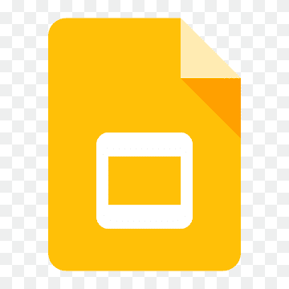

# Ferramentas
Esta seção tem por finalidade apresentar as ferramentas utilizadas pela equipe para desenvolver o projeto.

Ferramenta | Nome | Descrição
---|---|---
 | GitHub | GitHub é uma plataforma de hospedagem de código-fonte e arquivos com controle de versão que utilizam o Git como tecnologia de versionamento.
 | Microsoft Excel | Software utilizado para criar e editar planilhas.
 | Google apresentações | Software utilizado para criar e editar slides.
 | Discord | Aplicação gratuita utilizada para estabelecer comunicação entre os membros da equipe.
 | Google Drive | Software utilizado para compartilhar arquivos específicos, como vídeos de apresentação.
 | Visual Studio Code | Software desenvolvido pela microsoft para editar códigos.
 | Whatsapp | Aplicativo multiplataforma de mensagens instantâneas.